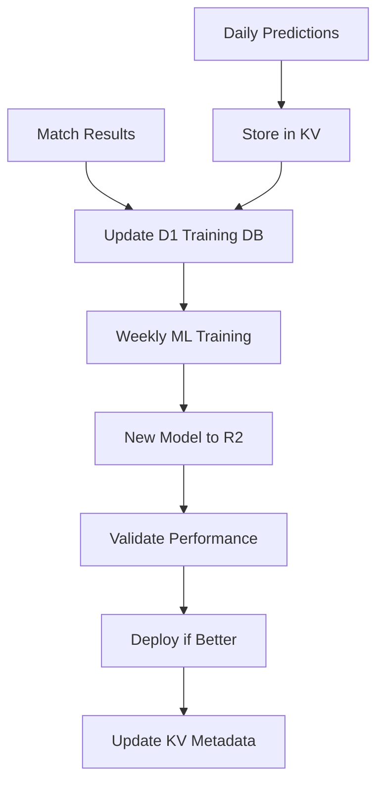
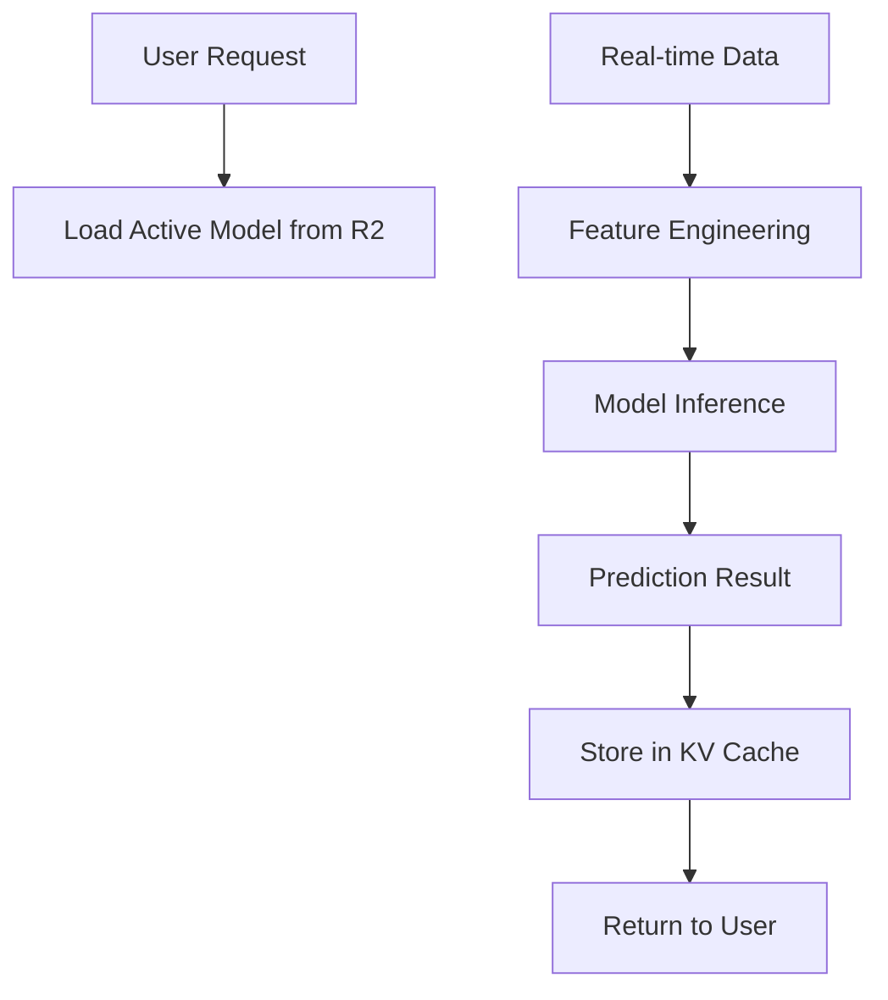

# ML Training Data Architecture for FixtureCast

## 🏗️ Infrastructure Overview

### Current Stack (Keep)
- **Cloudflare Pages**: Frontend hosting + Functions compute
- **Cloudflare KV**: Prediction caching (current system)
- **API-Football**: Real-time data source

### ML Enhancement (Add)
- **Cloudflare D1**: Structured training data storage
- **Cloudflare R2**: Model artifacts & large datasets
- **Cloudflare Workers**: ML training pipeline automation

## 📊 Data Storage Strategy

### 1. Cloudflare KV (Current - Expand)
```typescript
// Existing prediction storage
PREDICTIONS_KV: {
  "match_123_20250115": {
    prediction: Prediction,
    timestamp: number,
    actualResult?: MatchResult
  }
}

// Add ML metadata storage
ML_MODELS_KV: {
  "active_model_v1": {
    version: "1.2.3",
    accuracy: 0.762,
    deployedAt: timestamp,
    modelPath: "r2://models/v1.2.3.json"
  }
}
```

### 2. Cloudflare D1 Database (NEW)
```sql
-- Training data with rich features
CREATE TABLE training_records (
  id TEXT PRIMARY KEY,
  match_id TEXT,
  prediction_date DATE,
  
  -- Match details
  home_team TEXT,
  away_team TEXT,
  league TEXT,
  
  -- Prediction features
  home_attack_strength REAL,
  away_defense_strength REAL,
  injury_impact_score REAL,
  form_momentum_home REAL,
  form_momentum_away REAL,
  h2h_btts_rate REAL,
  data_quality_score REAL,
  
  -- Predictions made
  predicted_home_win REAL,
  predicted_draw REAL,
  predicted_away_win REAL,
  predicted_btts_yes REAL,
  predicted_over25 REAL,
  prediction_confidence REAL,
  
  -- Actual results
  actual_home_score INTEGER,
  actual_away_score INTEGER,
  actual_result TEXT, -- 'H', 'D', 'A'
  actual_btts BOOLEAN,
  actual_over25 BOOLEAN,
  
  -- Learning metrics
  prediction_accuracy REAL,
  confidence_calibration REAL,
  
  created_at DATETIME DEFAULT CURRENT_TIMESTAMP
);

-- Model performance tracking
CREATE TABLE model_performance (
  model_version TEXT,
  test_period_start DATE,
  test_period_end DATE,
  total_predictions INTEGER,
  correct_predictions INTEGER,
  accuracy_rate REAL,
  avg_confidence REAL,
  calibration_score REAL,
  created_at DATETIME DEFAULT CURRENT_TIMESTAMP
);

-- Feature importance tracking
CREATE TABLE feature_importance (
  model_version TEXT,
  feature_name TEXT,
  importance_score REAL,
  feature_category TEXT, -- 'injury', 'form', 'h2h', etc.
  league TEXT,
  updated_at DATETIME DEFAULT CURRENT_TIMESTAMP
);
```

### 3. Cloudflare R2 Storage (NEW)
```
ml-models-bucket/
├── models/
│   ├── v1.0.0/
│   │   ├── main_model.json        # Primary prediction model
│   │   ├── confidence_model.json  # Confidence calibration model
│   │   ├── feature_weights.json   # Feature importance weights
│   │   └── metadata.json         # Model training info
│   └── v1.1.0/
│       └── [updated models...]
├── training-data/
│   ├── raw/
│   │   ├── 2025-01-predictions.parquet
│   │   └── 2025-02-predictions.parquet
│   ├── processed/
│   │   ├── feature_matrix_2025Q1.parquet
│   │   └── labels_2025Q1.parquet
│   └── validation/
│       └── holdout_test_set.parquet
└── experiments/
    ├── feature_analysis/
    └── model_comparisons/
```

## 🔄 Data Flow Architecture

### Training Pipeline


### Prediction Pipeline


## 💰 Cost Analysis

### Cloudflare Pricing (Estimated Monthly)
```
D1 Database:
- First 5GB: Free
- Estimated usage: ~100MB/month = $0

R2 Storage:
- First 10GB: Free  
- Model files: ~50MB = $0
- Training data: ~500MB = $0

KV Storage (Current):
- Already in use = Current costs

Pages Functions:
- 100k requests/day = Free tier
- ML training: ~1k requests/week = Free

Total additional cost: ~$0-5/month
```

## 🚀 Implementation Phases

### Phase 1: Data Collection (Week 1)
- Add D1 database to wrangler.toml
- Create training data collection pipeline
- Start storing prediction outcomes in structured format

### Phase 2: Basic ML Pipeline (Week 2-3)  
- Add R2 bucket for model storage
- Implement basic model training in Workers
- Deploy first auto-improving model

### Phase 3: Advanced Learning (Week 4+)
- Feature importance tracking
- A/B testing different models
- League-specific model variants

## 🔧 Configuration Updates

### wrangler.toml additions:
```toml
[[env.production.d1_databases]]
binding = "ML_TRAINING_DB"
database_name = "fixturecast-ml-training"
database_id = "your-d1-database-id"

[[env.production.r2_buckets]]
binding = "ML_MODELS_BUCKET"  
bucket_name = "fixturecast-ml-models"
```

## 🛡️ Data Privacy & Security
- All data stays within Cloudflare infrastructure
- No PII stored (only match and prediction data)
- Models contain no user-identifiable information
- GDPR compliant (football data only)

## 📈 Expected Outcomes
- **Month 1**: Baseline data collection
- **Month 2**: First auto-improving model deployed
- **Month 3**: 2-3% accuracy improvement
- **Month 6**: 5-8% accuracy improvement  
- **Year 1**: Best-in-class prediction accuracy

This architecture keeps you 100% within the Cloudflare ecosystem while providing enterprise-grade ML capabilities at minimal cost.